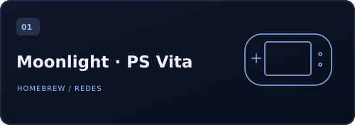
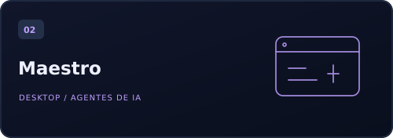
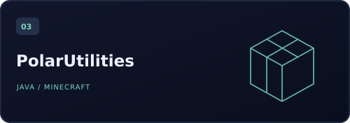
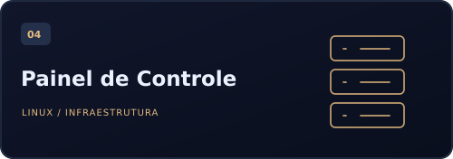
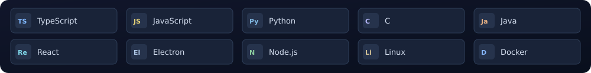

  

  <a href="#sobre"><strong>Sobre</strong></a> &nbsp; / &nbsp;
  <a href="#projetos"><strong>Projetos</strong></a> &nbsp; / &nbsp;
  <a href="#tecnologias"><strong>Tecnologias</strong></a> &nbsp; / &nbsp;
  <a href="https://frstech.com.br/"><strong>Trabalho &amp; contato ↗</strong></a>

 

### 01 / Sobre

Sou **Filipe Fabiani**, conhecido como **Polarco**. Desenvolvo aplicações e ferramentas que conectam software, automação e infraestrutura. Meus projetos vão de interfaces web e aplicações desktop a plugins para jogos e homebrew para PS Vita.

Gosto de entender o problema por inteiro: a experiência de quem usa, os processos por trás da interface e os sistemas que fazem tudo funcionar.

**Neste perfil:** projetos pessoais, ferramentas e experimentos.  
**Na [FRSTech](https://github.com/frssolutionstech-eng):** sistemas sob medida, automações e integrações para empresas.

 

### 02 / Projetos selecionados

<table>
<tr>
<td width="50%" valign="top">

**Streaming e redes no portátil.** Cliente experimental com WireGuard e lwIP dentro da aplicação.

`C` `VitaSDK` `WireGuard`

Streaming em LAN validado; streaming remoto ainda em validação.

**[Explorar projeto →](https://github.com/polarco/moonlight-tailscale-vita)**

</td>
<td width="50%" valign="top">

**Um workspace para agentes de IA.** Aplicação desktop local-first para conversas, planejamento e coordenação de tarefas.

`TypeScript` `React` `Electron`

MVP em evolução.

**[Explorar projeto →](https://github.com/polarco/maestro)**

</td>
</tr>
<tr>
<td width="50%" valign="top">

**Utilidades para servidores Minecraft.** Plugin modular com TPA, homes, warps, spawn e menus de administração.

`Java` `Paper` `Minecraft`

**[Explorar projeto →](https://github.com/polarco/PolarUtilities)**

</td>
<td width="50%" valign="top">

**Visibilidade sobre serviços Linux.** Interface web para acompanhar serviços, containers, processos e logs.

`JavaScript` `Node.js` `Docker`

**[Explorar projeto →](https://github.com/polarco/painel-de-controle)**

</td>
</tr>
</table>

**Também no laboratório:** [VitaTester](https://github.com/polarco/VitaTester), fork do projeto de SMOKE com testes de entrada, stress e scanner de hardware. A validação física das alterações continua em andamento.

[Ver todos os repositórios ↗](https://github.com/polarco?tab=repositories)

 

### 03 / Tecnologias nos meus projetos

| Área | Onde aplico |
| :--- | :--- |
| **Aplicações & interfaces** | Sistemas web, ferramentas desktop e experiências de uso. |
| **Automação & infraestrutura** | Agentes de IA, administração de serviços e containers. |
| **Homebrew & jogos** | PS Vita, streaming, diagnóstico de hardware e plugins Minecraft. |

 

### 04 / Vamos conversar

**Sobre um projeto open source?** Abra uma issue no repositório correspondente.  
**Sobre uma solução para sua empresa?** Conheça a **[FRSTech](https://frstech.com.br/)**.

 

Um pouco do espírito original continua por aqui: “Just a random guy making random things.”

