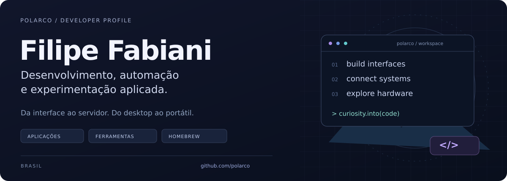

  

  <em>“Just a random guy making random things.”</em> 
  Às vezes é um app. Às vezes é um plugin. Às vezes é um PS Vita.

  <a href="https://github.com/polarco?tab=repositories"><strong>Meus projetos</strong></a>
  &nbsp; · &nbsp;
  <a href="https://github.com/frssolutionstech-eng"><strong>FRSTech</strong></a>
  &nbsp; · &nbsp;
  <a href="https://frstech.com.br/"><strong>Trabalho &amp; contato</strong></a>

 

### Oi, eu sou o Filipe 👋

Também conhecido como **Polarco**. Gosto de explorar tecnologia construindo coisas: ferramentas para o dia a dia, experiências com IA, utilitários para servidores e projetos para jogos e portáteis.

Por aqui, uma ideia pode começar numa necessidade pequena e acabar virando mais um repositório.

### Alguns projetos para conhecer

<table>
<tr>
<td width="50%" valign="top">

**🎮 [Moonlight Tailscale · PS Vita](https://github.com/polarco/moonlight-tailscale-vita)**

Streaming de PC no Vita com um túnel WireGuard dentro do aplicativo. Um encontro entre homebrew, redes e jogos.

C · VitaSDK · WireGuard · lwIP 
Experimental: streaming em LAN validado; streaming remoto ainda em validação.

</td>
<td width="50%" valign="top">

**🎛️ [Maestro](https://github.com/polarco/maestro)**

Central desktop local-first para conversar com agentes de IA, organizar planos e coordenar o trabalho em projetos.

TypeScript · React · Electron 
MVP em evolução.

</td>
</tr>
<tr>
<td width="50%" valign="top">

**🧊 [PolarUtilities](https://github.com/polarco/PolarUtilities)**

Plugin modular para servidores Minecraft: TPA, homes, warps, spawn e menus para jogadores e administradores.

Java · Paper · Minecraft

</td>
<td width="50%" valign="top">

**🖥️ [Painel de Controle](https://github.com/polarco/painel-de-controle)**

Interface web para acompanhar serviços Linux, containers Docker, processos e logs em um só lugar.

JavaScript · Node.js · Linux · Docker

</td>
</tr>
</table>

Também exploro diagnósticos de hardware no **[VitaTester](https://github.com/polarco/VitaTester)** — um fork do projeto de SMOKE, com testes de entrada, stress e scanner. A validação física das alterações continua em andamento.

### O que você vai encontrar por aqui

**Homebrew & jogos** — PS Vita, streaming e ferramentas para Minecraft.  
**IA & automação** — agentes, aplicações desktop e fluxos de trabalho.  
**Linux & infraestrutura** — serviços, containers e ferramentas de administração.

### Linguagens e ferramentas dos meus projetos

`TypeScript` · `JavaScript` · `Python` · `C` · `Java`  
`React` · `Electron` · `Node.js` · `Linux` · `Docker` · `Git`

---

  <strong>Encontrou algo útil ou teve uma ideia?</strong> 
  Abra uma issue no projeto — sugestões e relatos de problemas são bem-vindos.

Filipe Fabiani · Polarco · Brasil

